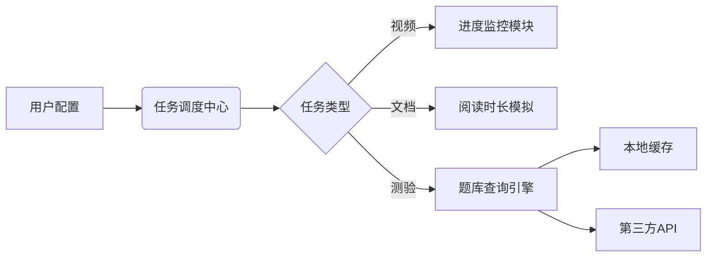

# 欢迎使用XueTongAuto
> 请给[作者](https://github.com/Hanzzkj652)点点Fllow捏🤗
:::tip
💡 欢迎使用XueTongAuto

😊 如果您喜欢本工具,请考虑赞助我们,您的赞助是我们更新的动力

:::

# 项目概述


:::warning
⚠️ 本工具仅用于学习交流,严禁用于**商业目的,收费代刷,倒卖**等行为,一切行为后果自负

⚠️ 请在使用前仔细阅读本工具的使用说明和免责声明

⚠️ 如因使用本工具导致的任何损失或损害,作者概不负责

⚠️ 本工具仅供学习交流使用,禁止任何形式的商业行为

:::

超星学习通自动化工具(XueTongAuto)是一款专门针对超星/学习通在线教育平台的智能任务处理工具，通过模拟用户操作实现课程任务的自动化完成，显著提升在线学习效率。

## 核心功能

### 多任务支持 
- 完整覆盖视频、文档、阅读、测验等课程形式
- 支持章节测验、考试模块的智能处理
- 自动识别未完成课程并生成执行队列

### 智能调度引擎 
- 多线程并行处理多门课程
- 自适应任务优先级调整
- 断点续做与异常恢复机制

### 题库集成系统 
- 内置多平台题库接口
```
    言溪题库    
    Like知识库   
    TikuAdapter题库
    AI大模型答题  
```
- 答案缓存与相似题匹配功能

### 安全运行模式 
- 模拟真人操作节奏
- 可配置不提交测试模式
- 详细的JSON日志记录

## 技术架构



## 典型使用场景

1. **批量课程处理**  
   同时处理多门课程的遗留任务
2. **定时作业提交**  
   设置定时自动完成每周作业
3. **考试辅助模式**  
   在练习模式下验证题库准确性
4. **学习数据分析**  
   通过运行日志分析学习进度

## 操作流程

1. 配置学习通账号信息
2. 选择需要处理的课程
3. 设置任务执行参数
4. 启动自动化处理
5. 查看实时日志监控

> 注意：请遵守学校相关规章制度，本工具仅用于技术研究目的